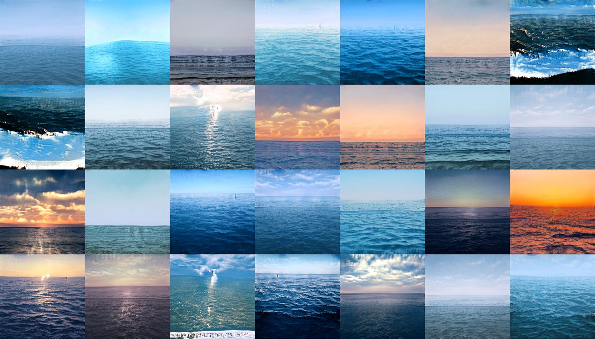

# seascapes
  🌅 AI seascapes generator made with StyleGAN / Runway and P5.js.

  Requires Runway to function. Download here [ 💥 🔥 🌪 🌈runwayml.com💗 💖](runwayml.com)  

 [👹 🌊 click here to chek my seascapes model](https://open-app.runwayml.com/?model=claraharguindey/seascapes")

  
  
  _the line drawn by the sea on the horizon is the terrestrial vision that has changed the least in history - the most shared vision among generations. What I see when looking at the horizon from the beach is the same thing my grandparents and my parents could see. The next logical step in this chain is to ask how do the machines see it? Your machine can generate new seascapes views here._ 

seascapes generated

 